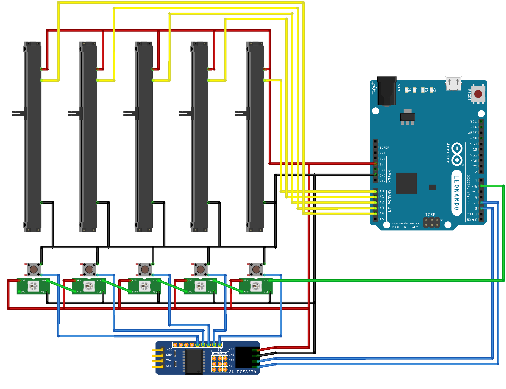

# Arduino-Midi-Fader-Panel

The arduino code in the repository is designed to be used with the midi controller enclosure found [here](https://www.thingiverse.com/thing:5269219). The controller has 5 faders each with a mute button and an RGB LED. 

## Schematic

# Parts List
- 5x [OUTEMU Blue](https://www.amazon.com/dp/B07V4S3QDK?psc=1&ref=ppx_yo2_dt_b_product_details) or other cherry compatible key switches
- 5x [60mm linear potentiometer](https://www.amazon.com/dp/B07PNDLKQQ?psc=1&ref=ppx_yo2_dt_b_product_details)
- 5x [ws2812b strip leds](https://www.amazon.com/gp/product/B088BGWL4J/ref=ppx_yo_dt_b_search_asin_title?ie=UTF8&psc=1) 100 leds/m is recommended 144 leds/m will probably also work
- 1x [PCF8574T Digital IO expansion](https://www.amazon.com/dp/B07XD2K4GH?psc=1&ref=ppx_yo2_dt_b_product_details)
- 1x Arduino Leonardo
- 1x [micro usb breakout](https://www.amazon.com/gp/product/B07W844N43/ref=ppx_yo_dt_b_search_asin_title?ie=UTF8&psc=1)
- 14x m3x8mm button head screws
- 22AWG stranded wire I bought [this kit](https://www.amazon.com/dp/B07Q3G1VG2?psc=1&ref=ppx_yo2_dt_b_product_details)

# Assembly

### 1. Faders
I started by inserting the faders into the keyswitch plate and securing them in place with a dab of hot glue. Careful when applying the hott glue to not get any on anything that moves. Superglue would probably also work as a more permanent solution but you would have to be even more carful about it getting on moving parts.

I then conneced one end of each of the faders to 5v with red wire and left a tail long enough to conenct to the other 5v branches for the pcf8574s and leds. I then did the same for the ground on the other end of each fader using black wire. Then I started soldering up the wiper pin on each fader and adding male dupont connectors to the ends to plug into the arduino.

### 2. Buttons
The next thing I worked on was the buttons. I inserted the keyswitches into the keyswitch plate and soldered a gound wire to one side of each switch. Then I soldered a second wire to each switch using blue wire for the fader buttons and white wire for the other buttons to stay organized and terminated each of thoes wires with female dupont connectors. 

### 3. LEDs
This was by far the longest part of the project since I had to solder up 3 wires to each led. I started by sticking each led to part 2 of each kaycap. For the soldering I just started at one end of the led chain and soldered 5v, ground, and data in to the input for the first led. I then did the same for the output and connected those wires to the input of the next LED and repeated this down the chain of leds until the end. 

### 4. Assembly
I finished the soldering by tieing all of the grounds together and all of the 5v leads together and make a wire harness to connect the arduino to the pcf8574s. Then started the physical assembly. 

First the keyswitch plate gets screwed into the body using 4 m3 screws. Make sure non of the wires get caught between the keyswitch plate and the body or it might not sit flat or could cause electrical problems.

The bottom can be screwed in but at this point its probably good to plug it in and upload code to do a sanity chec and make sure everything is working. 

Finally the keycap part 1s get inserted into the top plate and the top plate can be screwed into the body. Then the potentiometer caps can be added and everything should be done.

### 5. Software
This device was designed to work with [midi-mixer](midi-mixer.com) and thus has some odd functionality with the leds if it were to be used with something else, but it is a general midi controller and all of the faders and buttons should work fine with any software. 

The profile I have made for midi-mixer can be found here: [midi-mixer://share/d48e2fa4c56eb2f51210424da2a08aa8](midi-mixer://share/d48e2fa4c56eb2f51210424da2a08aa8)
